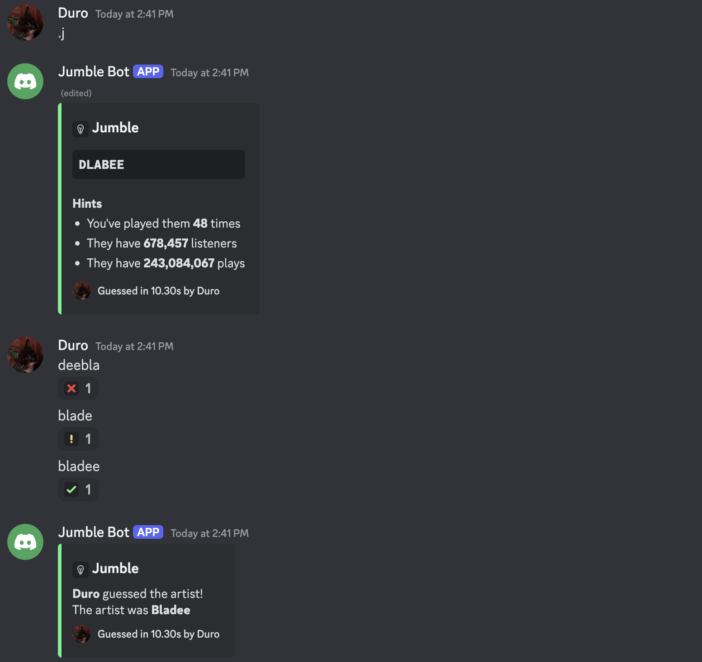

# LastFM Jumble Discord Bot



A Discord bot that hosts a jumble game based on the top artists of a last.fm user.

The game chooses a random artist from the user's top artists and jumbles the letters of the artist's name.

You have provided a few hints, and anyone in the chat has to guess the artist's name correctly within 25 seconds.

Made with the [sern](sern.dev) framework.

## Setup

1. Clone the repository
2. Install requirements with `bun install`
3. Create a `.env` file in the root directory with the following variables:

```sh
DISCORD_TOKEN=<YOUR_DISCORD_TOKEN>
LASTFM_API_KEY=<YOUR_LASTFM_API_KEY>
DATABASE_URL=<MONGODB_URL>
```

4. Run the bot with `bun start`

## Commands

- `.jumble` - Start a new jumble game (`.j`)
- `.leaderboard` - Show the leaderboard (`.lb` or `.top`)
- `.link` - Link your last.fm account to your Discord account
- `.unlink` - Unlink your last.fm account from your Discord account
